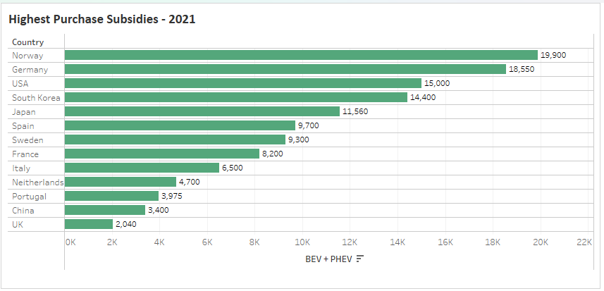
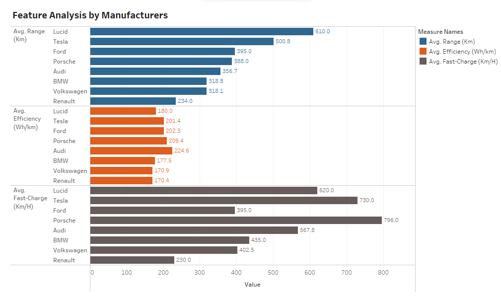

## Evolving Horizons: Unplugging the Future of Electric Vehicles

### Focus Areas

- EV Adoption Trends Across Regions
- Influential Factors in EV Adoption
- Manufacturer Comparison and Charging Infrastructure
- Sustainable Future: CO2 Emissions
- Conclusion

### Tech Stack
- Python
- Pandas
- Plotly
- NumPy
- Reveal.js
- Tableau

### Investigate the patterns of electric vehicle adoption across time, contrasting adoption rates among different regions

### EV Sales over the Years

<iframe scrolling="no" style="border:none;" seamless="seamless" data-src="assets/sales_over_years_bev_phev.html" height="400" width="100%"></iframe>

BEV : Battery Electric Vehicle
PHEV: Plug-in Hybrid Electric Vehicle

Over 25 million electric cars were on the road in 2022, 60% relative to 2021 and more than 5 times the stock in 2018

### EV Adoption Rate Among Regions

  <iframe scrolling="no" style="border:none;" seamless="seamless" data-src="assets/donut_chart_sales_share_regions.html" height="380" width="45%"></iframe>
  <iframe scrolling="no" style="border:none;" seamless="seamless" data-src="assets/bars_sales_shares_regions.html" height="380" width="45%"></iframe>

- Global EV sales were 10 million units in 2022, a 55% rise from 2021
- China, accounting for over half of global electric car sales with 5.9 million units, experienced a 60% increase
 

### Influential Factors in EV Adoption
- Purchase Price
- Range (Distance travelled with one recharge)
- Government Incentives

### Purchase Price
<iframe scrolling="no" style="border:none;" seamless="seamless" data-src="assets/BEV_price_trend_years_new.html" height="300" width="100%"></iframe>

<ul>
  <li>Reduction in Price:
    <ul>
      <li>Growing number of automakers entering the EV market</li>
      <li>Cost-efficient production of EV components</li>
    </ul>
  </li>
</ul>
<ul>
  <li>Rise in Price
    <ul>
      <li>Advanced features and Premium models</li>
      <li>Semi-conductor shortage in Covid-19 </li>
    </ul>
  </li>
</ul>

### Range
- Range Anxeity:  Running out of battery charge before reaching the destination or a charging station
- Range Enhancement: Advancements in battery materials and engineering to increase battery capacity

<iframe scrolling="no" style="border:none;" seamless="seamless" data-src="assets/EV_range_trend_years.html" height="300" width="100%"></iframe>

### Government Incentives
-  Providing financial aid through grants and subsidies
- Offering benefits such as reduced/waived road taxes, registration fees, and other vehicle-related levies
- Establishing public charging stations and facilitating discounted charging services
- Allowing access to low-emission zones and city centers

{ width=60% }

### Manufacturer Comparison and Charging Infrastructure

### Feature Analysis

{ width=100% }

### Top EV Models Around The Globe

{ width=80% }

### Charging Infrastructure

 <iframe scrolling="no" style="border:none;" seamless="seamless" data-src="assets/charging_stat_trend_years.html" height="400" width="100%"></iframe>

### Charging Stations in Germany

<iframe scrolling="no" style="border:none;" seamless="seamless" data-src="assets/charging_stat_germany.html" height="400" width="80%"></iframe>
Total Charging Points till Feb 2023: 71,263

### Sustainable Future: CO2 Emissions

### How much C02 a medium size car emits per km?
- If it is electric : 75g
- If it is gasoline: 241g

### Worst Case Vs Best Case Scenario

| **Worst Case** | **Best Case** |
|------------------------|------------------------|
|Electric car with Chinese-made battery, driven in Poland |Electric car with Swedish-made battery, driven in Sweden |
|CO2 Emission Reduction: 37% compared to petrol |CO2 Emission Reduction: 83% compared to petrol |

### Vehicles Carbon Emission Over Time

<iframe scrolling="no" style="border:none;" seamless="seamless" data-src="assets/combined_co2_emission_years_km.html" height="400" width="100%"></iframe>

### Conclusion

-  Global Shift Towards Electric Mobility 

- Factors influencing EV adoption, such as purchase price, range and government incentives highlight the diverse aspects of this transformation 

- The collective efforts of governments, industries, and individuals become paramount in driving positive change 

- Make informed choices, and unite efforts for a sustainable future 

###

{ width=60% }

The road ahead is long, but together, we are driving change – one electric km at a time

### References

  
    - Kaggle
      - <a href="https://www.kaggle.com/datasets/edsonmarin/historic-sales-of-electric-vehicles">Historic Sales of Electric Vehicles</a>
      - <a href="https://www.kaggle.com/datasets/saketpradhan/alternative-fuel-vehicles-in-the-us">Alternative Fuel Vehicles in the US</a>
  

  
    - International Energy Agency (IEA)
      - <a href="https://www.iea.org/data-and-statistics/data-tools/global-ev-data-explorer">Global EV Data Explorer </a>
  

  
    - Environmental Protection Agency US (EPA)
      - <a href="https://www.epa.gov/automotive-trends/explore-automotive-trends-data">Explore Automotive Trends Data</a>
  

  
   - Electric Vehicle Charging in Germany
    - <a href="https://www.kaggle.com/datasets/mexwell/electric-vehicle-charging-in-germany">Electric Vehicle Charging in Germany</a>
   

  
    - Different Articles
      - <a href="https://www.ev-volumes.com/">EV Volumes</a>
      - <a href="https://alternative-fuels-observatory.ec.europa.eu/general-information/news/european-ev-market-analysis-strong-growth-continues-plug-vehicle">European EV Market Analysis</a>
      - <a href="https://joint-research-centre.ec.europa.eu/jrc-news-and-updates/electric-or-conventional-car-2018-05-15_en">Electric or Conventional Car</a>
      - <a href="https://www.panion.org/ev-incentives-2023-these-6-countries-promote-e-mobility-the-most/">EV Incentives 2023</a>
      - <a href="https://climate.mit.edu/ask-mit/are-electric-vehicles-definitely-better-climate-gas-powered-cars">Are Electric Vehicles Definitely Better for the Climate?</a>
  

